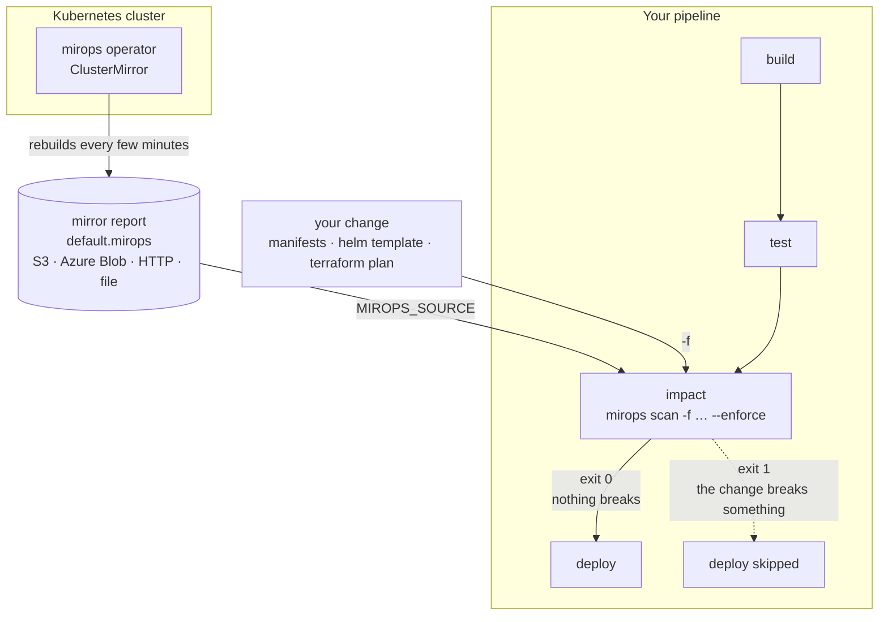

# Mirops CLI

`mirops-cli` is the pipeline gate of [mirops](https://github.com/miropshq/mirops). The `mirops` operator keeps a live **Cluster Mirror** of your cluster — every workload, Service, volume and Ingress, what depends on what, and what is broken right now — and publishes it as a report. One command, `mirops scan`, reads that report and answers, before you deploy: **does this change break anything that is running?**

It runs three checks, picked by the inputs you give it:

| Check | Input | What it answers | Blocks? |
| --- | --- | --- | --- |
| **Impact of a change** | `-f` / `MIROPS_FILE` | Does what I'm about to apply — manifests or a Terraform plan — break something in the cluster? | Yes, with `--enforce` |
| **Namespaces' state** | `-n` / `MIROPS_NAMESPACE` | What is at risk in my namespaces right now, and what depends on it? | Never |
| **Upgrade gate** | `--upgrade` / `MIROPS_UPGRADE` | Is the cluster ready for the Kubernetes upgrade the operator analysed? | Yes, with `--enforce` |

It reads the mirror report, **never the cluster**, so the pipeline needs no kubeconfig and adds no load on the API server. It's configured only through `MIROPS_*` environment variables.

## How it works



1. The operator rebuilds the mirror on an interval and writes its report to a destination your pipeline can read (`s3://…`, `azure://…`, `http(s)://…` or a file).
2. In the `impact` stage, `mirops scan` reads that report and the change — rendered manifests or a Terraform plan.
3. It looks up every object the change touches in the mirror: what it mounts, routes to or uses, and who uses it.
4. With `--enforce` it exits `1` when the change breaks something, so the job fails and **the deploy doesn't run**. Otherwise it exits `0` and prints the context (what's already broken, the blast radius). It exits `2` when it can't evaluate (a missing report, an unrendered source), never a silent pass.

Example — a Deployment that mounts a volume the mirror shows as `Pending`:

```text
$ mirops scan -f k8s/ -n demo-shop --enforce
MIROPS  mirror aws-test · cluster v1.35.8-eks · rebuilt 2026-09-28T04:57:27Z
Cluster now: 2 component(s) at risk in 1 of 6 namespaces

NAMESPACES — 1 of 1 with components at risk (informational, never blocks)
  demo-shop                  2 of 7 at risk                         High (70)
    deployment/payments-api  Down            → 1 depends on it      High (70)
    pvc/payments-db-data     Pending         nothing depends on it  Medium (50)

IMPACT — demo-shop
  read YAML: 1 Kubernetes change(s) → 1 evaluated

  ✗ BLOCK deployment/reports-worker mounts pvc/payments-db-data, which is Pending — pods that mount it won't start
$ echo $?
1
```

## Features

- Reads reports from local files and `file://` sources
- Supports `http://` and `https://` report URLs
- Supports `s3://` and `azure://` report sources through provider implementations
- One command, `mirops scan`: the inputs you give pick the checks
- Namespaces' current state from the mirror: one, a list, or `all` — at-risk components and their dependents (informational)
- Upgrade check switched on with `MIROPS_UPGRADE`, reading the UpgradeAnalysis report at `MIROPS_UPGRADE_SOURCE` — the target version comes from that report, and the check skips itself once the cluster runs it
- A gate you control: `--enforce` fails the pipeline on a blocked upgrade (`--enforce-level warning` to be stricter); without it, every run is report-only
- Renders the operator's upgrade decision (`SAFE` / `WARNING` / `CRITICAL`)
- Impact check with `-f`: rendered manifests (YAML or JSON — a file, a directory, or stdin) or a Terraform plan (`terraform show -json`), including `kubernetes_*`, `kubernetes_manifest` and `kubectl_manifest` resources
- Blocks only on what the change breaks: deleting something still in use, mounting a `Pending` / `Lost` / missing volume, routing to a missing Service, depending on what the same change deletes
- Filters by namespace (`MIROPS_NAMESPACE`): a repo is judged only on its own namespaces, and objects without a namespace (`helm template` output) go to the one you name
- Refuses sources that aren't what will be applied — `values.yaml`, `kustomization.yaml`, `{{ }}` templates, `.tf` files, binary plans — with the command that renders them
- Lists the files a directory scan ignored, and refuses a mirror report older than `--max-mirror-age`
- Prints a table, or JSON with a `schemaVersion` for other tools
- Every flag can be set as a `MIROPS_*` environment variable
- Fixed exit codes: `0` pass, `1` blocked (with `--enforce`), `2` couldn't evaluate — never a silent pass

## Install

Download the release binary for your platform, make it executable, and put it on your `PATH`. **No `sudo` required** — this works the same on a laptop or in a CI pipeline.

```sh
# 1. Download the binary for your platform (see the table below for the name)
curl -fsSL -O https://github.com/miropshq/mirops-cli/releases/latest/download/mirops-darwin-arm64

# 2. Install it on a user-writable dir on your PATH
mkdir -p "$HOME/.local/bin"
cp mirops-darwin-arm64 "$HOME/.local/bin/mirops"
chmod +x "$HOME/.local/bin/mirops"

# 3. Ensure the dir is on your PATH (add to your shell rc to persist)
export PATH="$HOME/.local/bin:$PATH"

# 4. Verify
mirops --version
```

### Platform binaries

| Platform | Binary |
| --- | --- |
| macOS (Apple Silicon) | `mirops-darwin-arm64` |
| macOS (Intel) | `mirops-darwin-amd64` |
| Linux (x86_64) | `mirops-linux-amd64` |
| Linux (arm64) | `mirops-linux-arm64` |
| Windows (x86_64) | `mirops-windows-amd64.exe` |

Swap the binary name in the `curl` URL for your platform.

### Latest vs. pinned version

```sh
# Always the newest release
curl -fsSL -O https://github.com/miropshq/mirops-cli/releases/latest/download/mirops-linux-amd64

# Pin a version (reproducible — recommended for CI)
curl -fsSL -O https://github.com/miropshq/mirops-cli/releases/download/v0.2.0/mirops-linux-amd64

# Try a beta before it's released — pre-releases are tagged vX.Y.Z-beta.N and never become "latest"
curl -fsSL -O https://github.com/miropshq/mirops-cli/releases/download/v0.3.0-beta.1/mirops-linux-amd64
```

Betas are published from the `beta` branch; a stable release follows when it's merged into `main`.

### Verify the checksum (optional)

```sh
curl -fsSL -O https://github.com/miropshq/mirops-cli/releases/latest/download/checksums.txt
shasum -a 256 --check --ignore-missing checksums.txt   # macOS
sha256sum --check --ignore-missing checksums.txt        # Linux
```

## Requirements

Building from source (not needed to install a release binary):

- Go 1.26.2 or newer

## Build

```sh
go build -o bin/mirops .
```

Run from source:

```sh
go run . scan --source ./report.mirops
```

## Usage

Point `MIROPS_SOURCE` at the ClusterMirror report (`<name>.mirops`, e.g. `s3://mirops-reports/prod/default.mirops`; from the operator's reports service, add `?kind=ClusterMirror`), then give `mirops scan` the inputs for the checks you want:

| Input | Check | Gates? |
| ----- | ----- | ------ |
| `--upgrade` / `MIROPS_UPGRADE=true` | **Upgrade.** Off by default. Gates on the UpgradeAnalysis report you point `--upgrade-source` / `MIROPS_UPGRADE_SOURCE` at; the target version comes from that report. The cluster already runs it → nothing to check (exit `0`). No `MIROPS_UPGRADE_SOURCE`, an unreadable report, or upgrade analysis off in the cluster → exit `2`. | Yes |
| `-n` / `--namespace` / `MIROPS_NAMESPACE` | **Namespaces' state**: one namespace, a comma-separated list, or `all` (only the namespaces with something at risk, plus a count of the healthy ones). Reads the mirror report, so it adds no load on the cluster. | Never |
| `-f` / `--file` / `MIROPS_FILE` | **Impact** of what you're about to apply: a manifest file, a directory, `-` for stdin, or a Terraform plan (`terraform show -json`). With `-n`, only changes in those namespaces are judged. | Yes |

Give several and they all run: the impact of the change, the namespaces' state, and the upgrade verdict — the impact and the verdict set the exit code. Give none and the CLI exits `2` ("nothing to scan").

### Cluster upgrade pipeline

```yaml
env:
  MIROPS_SOURCE: s3://mirops-reports/prod/default.mirops
  MIROPS_UPGRADE: ${{ vars.MIROPS_UPGRADE }}   # "true" during the upgrade window, e.g. as a CI variable
  MIROPS_UPGRADE_SOURCE: s3://mirops-reports/prod/to-1-35.mirops
  MIROPS_ENFORCE: "true"
steps:
  - run: mirops scan
  - run: terraform apply
```

Upgrade analysis itself is switched on in the mirops install (Helm `upgrade.enabled=true`), which is where the UpgradeAnalysis — and so the target version — comes from. `MIROPS_UPGRADE` only tells this pipeline to gate on it, and `MIROPS_UPGRADE_SOURCE` says where its report is. Each source is read with the pipeline's own credentials for its scheme (AWS for `s3://`, Azure for `azure://`), so the two reports can live in different places. Once the cluster runs the target version the check reports `skipped` and passes, so the variables can stay set between upgrades.

### Impact of a change

Run it as the `impact` stage, after the build and before the deploy. When it blocks, the job fails and the deploy job — which `needs` it — doesn't run:

```yaml
jobs:
  impact:
    runs-on: ubuntu-latest
    permissions: { contents: read, id-token: write }
    env:
      MIROPS_SOURCE: s3://mirops-reports/prod/default.mirops
      MIROPS_NAMESPACE: payments        # the namespaces this repo deploys to
      MIROPS_ENFORCE: "true"
    steps:
      - uses: actions/checkout@v4
      - uses: aws-actions/configure-aws-credentials@v4   # read access to the report (see "Credentials")
        with: { role-to-assume: "${{ vars.AWS_ROLE_ARN }}", aws-region: us-east-1 }
      - run: helm template payments ./chart | mirops scan -f -
      # or: mirops scan -f k8s/                         (a directory of .yaml / .yml / .json)
      # or: terraform show -json plan.out | mirops scan -f -

  deploy:
    needs: impact                       # skipped when the impact check blocks
    runs-on: ubuntu-latest
    steps:
      - run: kubectl apply -f k8s/
```

With `--enforce` it blocks (exit `1`) only on what the change breaks:

- deleting a PVC, Service, ConfigMap or Secret that something still uses;
- mounting a PVC that is `Pending`, `Lost`, or doesn't exist; an Ingress routing to a Service that doesn't exist;
- depending on something the same change deletes.

What's already broken, and what depends on what the change touches (its blast radius), is shown as information. What the report can't vouch for yet — whether a ConfigMap or Secret exists — is marked `?`.

It reads rendered output only: `values.yaml`, `Chart.yaml`, `kustomization.yaml`, `.tf` files, templates with `{{ }}` and binary plans are refused with the command that renders them (exit `2`). In a directory it reads every `.yaml`, `.yml` and `.json` file and lists what it ignored (other files, empty ones, hidden directories). A `-n` namespace that is neither in the mirror nor in the change exits `2` — most likely a typo. A mirror report older than `--max-mirror-age` (default `1h`) exits `2`.

### Filtering by namespace

Set `MIROPS_NAMESPACE` (or `-n`) to the namespaces a repo deploys to — one, a comma-separated list, or `all`. With `-f`:

| The change… | Without `-n` | With `-n payments` |
| --- | --- | --- |
| touches `payments` and `orders` | both are judged | only `payments` is judged; `orders` is counted as "in other namespaces" and never blocks |
| has objects with no namespace (`helm template`) | not judged — "pass the one namespace it deploys to with -n" | judged in `payments` (a single `-n` only) |
| creates a namespace | judged | judged if it's one of `-n` |

A `-n` namespace that is neither in the mirror nor in the change exits `2` — most likely a typo, and judging nothing would pass the gate unchecked. `-n` also prints those namespaces' current state, which never blocks.

### Namespaces' state

```sh
mirops scan -n payments
mirops scan -n payments,checkout,orders
mirops scan -n all
```

### Pointing at an analysis directly

`--source` can also be an UpgradeAnalysis report (`<name>.mirops`), as with v0.1.0 — pointing at it is the request, so the CLI gates on it as is (then `--upgrade-source` and `--namespace` don't apply).

## Command Reference

```text
mirops scan [flags]
```

Every flag can be set through the environment as `MIROPS_<FLAG>` (dashes become underscores). Precedence: flag, then environment, then default. A variable that doesn't parse stops the CLI with exit `2`.

| Flag | Environment variable | Description |
| ---- | -------------------- | ----------- |
| `--source` | `MIROPS_SOURCE` | ClusterMirror report: path, `file://`, `s3://`, `azure://`, `http://`, or `https://` |
| `--upgrade` | `MIROPS_UPGRADE` | Run the upgrade check against the report at `--upgrade-source` |
| `--upgrade-source` | `MIROPS_UPGRADE_SOURCE` | UpgradeAnalysis report to gate on: path, `file://`, `s3://`, `azure://`, `http://`, or `https://` |
| `-n`, `--namespace` | `MIROPS_NAMESPACE` | Namespaces to show the state of — and, with `-f`, the only ones the change is judged in: one, a comma-separated list, or `all` |
| `-f`, `--file` | `MIROPS_FILE` | What you're about to apply: a manifest file, a directory, `-` for stdin, or a Terraform plan in JSON |
| `--max-mirror-age` | `MIROPS_MAX_MIRROR_AGE` | Oldest mirror report `-f` accepts (default `1h`) |
| `--enforce` | `MIROPS_ENFORCE` | Exit `1` when a check blocks |
| `--enforce-level` | `MIROPS_ENFORCE_LEVEL` | Minimum upgrade level that blocks: `critical` (default) or `warning` |
| `--output` | `MIROPS_OUTPUT` | `table` or `json` |
| `--timeout` | `MIROPS_TIMEOUT` | Request timeout duration |
| `--retry` | `MIROPS_RETRY` | Number of retries on failure |

SaaS-related flags are present but not implemented yet:

| Flag | Environment variable |
| ---- | -------------------- |
| `--api-url` | `MIROPS_API_URL` |
| `--api-token` | `MIROPS_API_TOKEN` |
| `--cluster` | `MIROPS_CLUSTER` |

### Exit codes

| Code | Meaning |
| ---- | ------- |
| `0` | Passed, or nothing to check on purpose (no upgrade pending) |
| `1` | A check blocked — the change breaks something, or the upgrade isn't allowed — and `--enforce` is set |
| `2` | Couldn't evaluate: missing or unreadable source, unknown report kind, bad flag, variable or argument, nothing to scan, a `-n` that is in neither the mirror nor the change, a source that must be rendered first (`values.yaml`, `kustomization.yaml`, `{{ }}`, `.tf`, binary plan), a mirror report older than `--max-mirror-age`, `MIROPS_UPGRADE=true` without `MIROPS_UPGRADE_SOURCE`, upgrade check requested while upgrade analysis is off. Never treated as a pass. |

### JSON output

`--output json` prints one document with a `schemaVersion` (currently `1`) and one block per check that ran — `checks.impact` (`summary` — format, changes read and evaluated, what was skipped, `ignored` files — plus `blocking`, `blockers`, `info`, `notVerified`), `checks.upgrade` (`status`: `evaluated` or `skipped`, `source` — where the upgrade report was read — plus `blocking`, `level`, `blockers`, …) and `checks.namespaces` (a list). New fields may be added without a version bump; breaking changes bump `schemaVersion`.

## Credentials

`mirops scan` reads each source with the pipeline's own credentials for its scheme — it has no credential flags:

| Source | Credentials |
| --- | --- |
| `s3://` | The AWS SDK chain: `AWS_ACCESS_KEY_ID` / `AWS_SECRET_ACCESS_KEY` / `AWS_SESSION_TOKEN`, a web identity (`aws-actions/configure-aws-credentials` with a role, IRSA), `AWS_PROFILE`, or the machine's role. Set `AWS_REGION` to the bucket's region. Needs only `s3:GetObject` on the report. |
| `azure://` | `DefaultAzureCredential`: `AZURE_CLIENT_ID` / `AZURE_TENANT_ID` / `AZURE_CLIENT_SECRET`, workload identity, or managed identity. Needs read access to the blob. |
| `http(s)://` | None — e.g. the operator's reports service, `http://mirops-reports.mirops:8084/reports/<name>.mirops?kind=ClusterMirror`, from inside the cluster. |

## Decision Logic

The upgrade decision is computed by the `mirops` operator from deterministic facts (incompatible add-ons, lost PVCs, PDBs, CPU/memory pressure, pods not ready) and reported in `decision`. The CLI renders it verbatim — it does **not** recompute the gate from the score (`scores.total` is a readiness gauge only).

| Result | Meaning |
| ------ | ------- |
| `CRITICAL` | `decision.allow == false` — do not upgrade; reasons listed as blockers |
| `WARNING` | Upgrade possible but issues were detected |
| `SAFE` | Cluster ready, upgrade recommended |

With `--enforce`, the upgrade check blocks when the upgrade is not allowed (CRITICAL). `--enforce-level warning` is stricter and also blocks on WARNING. A namespace's state never blocks.

The impact check decides on its own, from the mirror's graph — it blocks only on what the change breaks, never on what is already broken: a deploy that touches a component that is `Down` passes, with that state shown as context, because the deploy may be the fix.

## Development

Run tests:

```sh
go test ./...
```

Format the code:

```sh
go fmt ./...
```

## License

See `LICENSE`.
